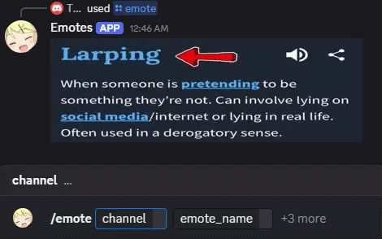

# Emote Integration

### ➡️About

This Discord app allows you to grab any 7TV/BTTV/FFZ Twitch emote from any Twitch channel's emote set and post it in a server, group chat, or dms.

**Features**:
- Grab an emote from any Twitch channel or global emotes and post it
- List all emotes from any Twitch channel
- Modify the emotes with BTTV emote effects (COMING SOON)

### ➡️Installation

**No install link since I can't be letting anyone use my computer's processing, however installation is easy and free, shown below**

**Discord Portion:**
1. Go to Discord Developer Portal and make a new application - https://discord.com/developers/home
2. Go to OAuth2 tab, check "applications.commands" box, select User Install under Integration Type, then save that url somewhere (everytime you make a new command or change command parameters then you'll have to reinstall the app)
3. For server install, also check the "bot" box, and then under "Bot Permissions" check "View Channels", "Send Messages", "Embed Links", "Attach Files", and "Use Slash Commands". Make sure to also select Guild Install under Integration type

**Backend Portion:**
1. Clone this repo
2. Install discord.py to this project's folder on your computer (guide: https://discordpy.readthedocs.io/en/stable/intro.html)
3. Edit config.json, make sure to remove the "(REMOVE THIS PART)" in the file's title. Token can be obtained in the "Bot" tab in the Discord Developer Portal
4. Run main .py

### ➡️Credits

- 7TV, BetterTTV, FrankerFaceZ - emote services
- discord.py - framework for making this app in python
- chuckxD (github) - useful list of FFZ/BTTV api endpoints https://gist.github.com/chuckxD/377211b3dd3e8ca8dc505500938555eb
- https://api.ivr.fi/v2/docs - used for getting Twitch user id from channel name without the need of Twitch's official api since that requires setup
